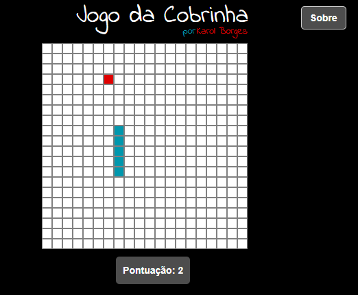

# Jogo da Cobrinha - por Karol Borges
> Jogo video game popular em que a cobra cresce ao comer as maças e morre ao se tocar(ou tentar se comer) e ao bater nas paredes da arena.

O Jogo foi implementado em React e teve as regras básicas de:

-O jogador controla uma cobra que se arrasta pela tela, coletando as maças, não podendo colidir com seu próprio corpo ou os limites da arena; 

-Cada vez que a cobra come um maça, seu rabo aumenta;

-O usuário controla a direção da cabeça da serpente (para cima, para baixo, esquerda e direita), com as setas do teclado e seu corpo segue.

## Deploy

Link para o deploy feito: https://codepen.io/karol-borges/full/wNZOjV
